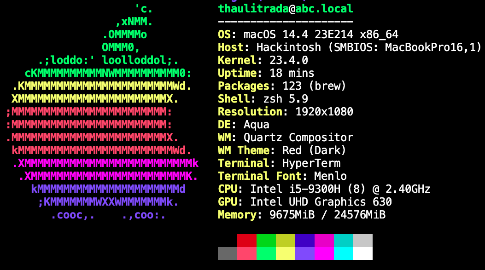
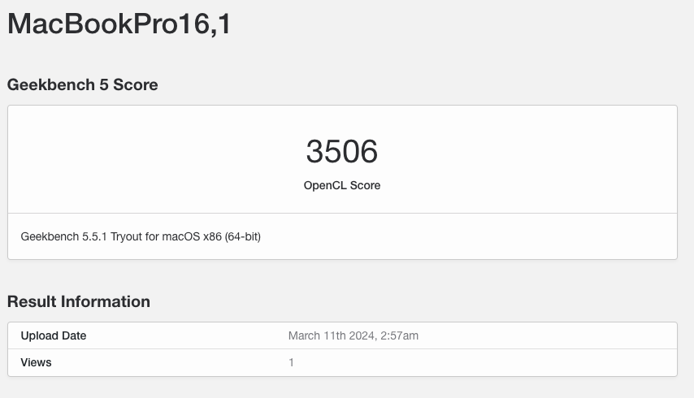
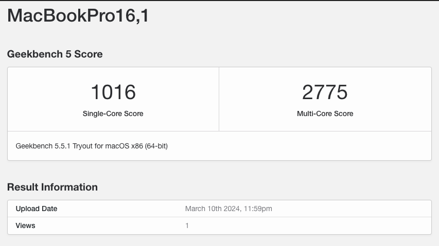

# Hackintosh-Acer-Nitro5-An515-54

#### Running macOS Sonoma 14.4

 

## System Details

| Model            | Acer Nitro 5 AN515-54                                        |
| :--------------- | :----------------------------------------------------------- |
| Processor        | Intel i5-9300H                                               |
| GPU              | Intel UHD Graphics 630 & NVIDIA GeForce® GTX 1650 (Disabled) |
| Memory           | 24GB                                                         |
| SSD              | 1x XPG GAMMIX S41 M.2 SSD 512 GB                             |
| WiFi / BT        | Intel WIFI 6 AX200 160MHz                                    |
| Audio            | Realtek ALC255                                               |
| Touchpad         | ELAN (ETDI2C) Version 13.6.14.1                              |
| BIOS Version     | 3.2                                                          |
| OpenCore Version | 0.9.4                                                        |

 

## Geekbench

- CPU Benchmark

 

- Compute Benchmark

 
 

## Whats not working:

- HDMI
- Nvidia GeForce® GTX 1650
